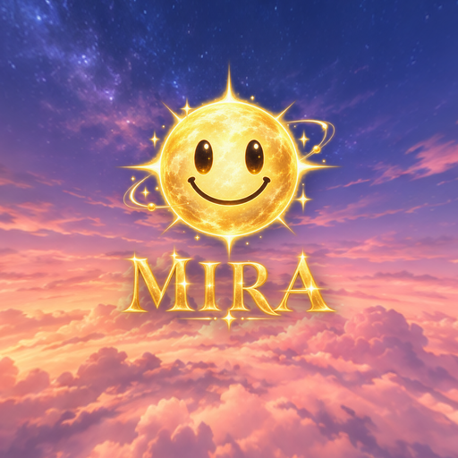
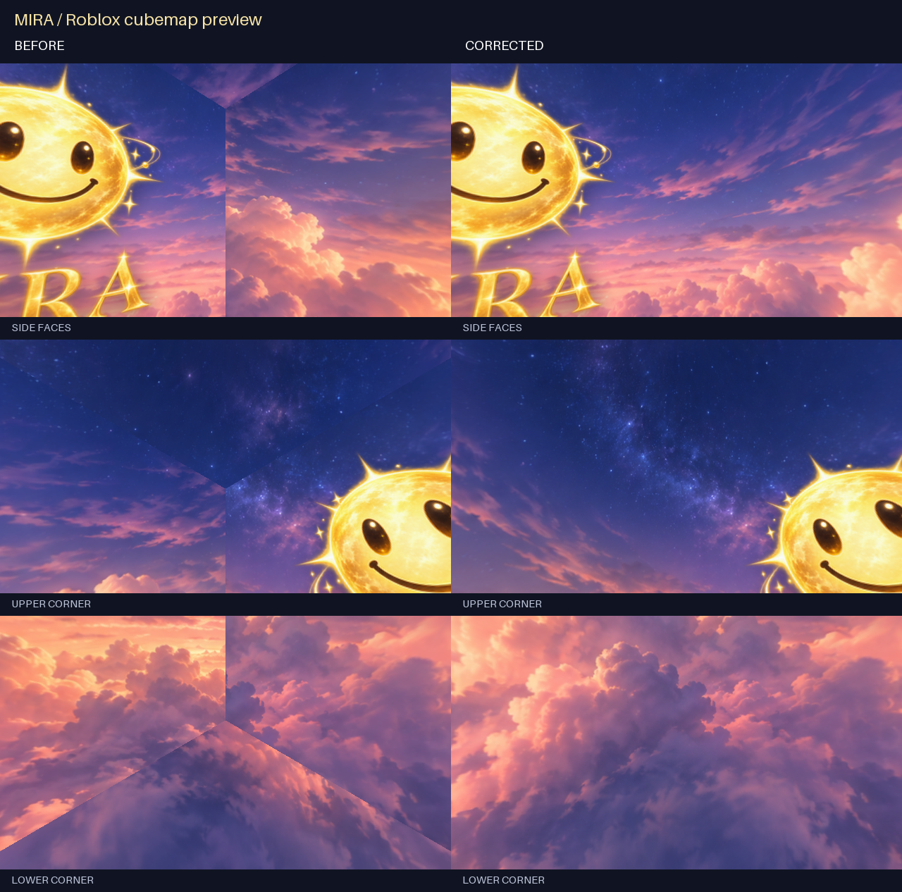

# MIRA Twilight Skybox for Crossroads



A six-face skybox for [Roblox Crossroads](https://www.roblox.com/games/1818/Crossroads), loaded through [Fleasion](https://github.com/fleasion/Fleasion). A twilight cloud panorama wraps around the player; a smiling golden sun and the exact word **MIRA** appear on the front face. The shared JSON uses `"mode": "cdn"` and public `raw.githubusercontent.com` image URLs. You only need the JSON profile; Fleasion fetches the six 512-pixel PNGs from GitHub.

**[Download the ready-to-use JSON profile](https://raw.githubusercontent.com/Aerobabel/fleasion-skybox/main/bundle/Crossroads-Mira-Sky.json)** · [View the JSON](bundle/Crossroads-Mira-Sky.json)

## Seam correction

The corrected export uses Roblox's face layout: the lateral faces and cap rotations now line up. All 12 adjoining edges match pixel-for-pixel, including the eight corners. The renderer also closes the panorama's longitude wrap and smooths its poles. The MIRA artwork and Crossroads asset IDs are preserved.

The supplied [Bimbocore Glam v1.2 example](https://github.com/BuyKevin/rivals-bimbocore-glam-pack/blob/main/CHANGELOG_v1.2.md) and [Roblox's skybox guide](https://devforum.roblox.com/t/custom-skyboxes-101/2849003) document the face-convention requirements. [Technical notes](art/README.md) explain the checks; [the edge report](art/seam-report.json) records the result.



This comparison is a rendered cubemap preview, not an in-game screenshot. After updating the JSON, clear Roblox's cache in Fleasion and rejoin to load the corrected image URLs.

## Live test

On 24 September 2026, Fleasion v2.4.0 captured the six `null_plainsky512_*.jpg` requests below during a fresh Crossroads launch. After clearing Roblox's cache, Fleasion served all six MIRA PNGs and the gold smiley appeared in Crossroads. That in-game test used the local-file profile. All six public CDN URLs were then downloaded without authentication: each returned HTTP 200, PNG content, and the exact SHA-256 of its bundled texture. The CDN profile has not yet had a separate in-game test.

| Face | Fleasion asset ID | Bundled texture |
|---|---:|---|
| Back | 12221870 | `Bk.png` |
| Down | 12221876 | `Dn.png` |
| Left | 12221895 | `Lf.png` |
| Right | 12221908 | `Rt.png` |
| Front | 12221889 | `Ft.png` |
| Up | 12221917 | `Up.png` |

The profile matches asset IDs, so it may also recolor the default sky in other Roblox experiences while enabled. Disable the profile and clear Roblox's cache to restore the usual sky.

## Install

1. Install Fleasion from its [official releases](https://github.com/fleasion/Fleasion/releases) and run it once.
2. Click **Open Configs** in Fleasion to find its configuration folder, then close Fleasion and Roblox Player.
3. Save the [raw JSON profile](https://raw.githubusercontent.com/Aerobabel/fleasion-skybox/main/bundle/Crossroads-Mira-Sky.json) there as **Crossroads-Mira-Sky.json**. On Windows, this is normally `%LOCALAPPDATA%\FleasionNT\configs`. To update an existing installation, replace its same-named JSON with this CDN version.
4. Start Fleasion and enable **Crossroads-Mira-Sky** in its Dashboard. Disable any older skybox profile that targets the same six IDs. Clear Roblox's cache in Fleasion, then launch Crossroads through its configured Roblox Player.
5. Look toward the front sky face for the smiley and **MIRA**, then look around to check the other faces. The lettering sits below the smiley and may be hidden by map walls from some viewpoints.

No image folder, Python installation, or local image paths are required for this setup. The six image URLs are pinned to the artwork commit so everyone receives the same textures.

## Optional script setup and verification

With Python 3.10+, a full repository checkout can also install the profile and texture copies for byte verification. Close Fleasion and Roblox Player first:

```powershell
python skybox.py verify
python -m unittest discover -s tests -v
python skybox.py install
```

Enable the profile and clear the cache as described above. For a full bundle installed by the script, confirm the files and enabled profile:

```powershell
python skybox.py installed
```

The installer writes its CDN JSON profile and six verification PNGs into Fleasion's `configs` folder. It refuses to overwrite an existing profile. Verification and removal also recognize the local-file profile format when the images match the current bundle. Fleasion configures the proxy and Player trust bundle separately; this project does not change them. On macOS or Linux, use `python3` and pass `--home` if Fleasion stores data outside the default location.

If the previous **Crossroads-Diagnostic-Sky** profile is still enabled, turn it off in Fleasion before installing this one. The new name lets both profiles coexist without overwriting personal configuration.

## Verify the live result

Enable Fleasion's Cache Scraper before launching Crossroads. After clearing the cache and joining, search the scraper for `12221`: all six IDs above should appear. The visible sky should be twilight clouds rather than the default blue clouds. The front face should show an upright smiley and the exact word **MIRA**.

`skybox.py probe` is an optional direct byte test through Fleasion's local proxy. It needs the proxy port and Fleasion's **public** CA certificate:

```powershell
python skybox.py probe --ca "C:\path\to\ca.crt" --port 58443
```

The no-cookie probe returned HTTP 404 during the September 2026 test, even though the in-game checkerboard and scraper confirmed the replacement. A failed probe alone does not establish failure in Player. Do not share Roblox cookies, auth tickets, private CA keys, or full proxy logs when reporting a test.

## Artwork and regeneration

The source panorama and transparent MIRA emblem are in [`art/`](art/). They were generated with OpenAI's built-in image generation tool; the exact prompts are recorded in [`art/README.md`](art/README.md). The optional [`art/render_skybox.py`](art/render_skybox.py) projects the panorama into six faces and composites the emblem on the front face. It requires Pillow and NumPy:

```powershell
python -m pip install pillow numpy
python art/render_skybox.py
python art/check_seams.py
python skybox.py build
python skybox.py verify
```

If you regenerate any face, update its fixed SHA-256 in `skybox.py` after reviewing the result. Commit the new artwork, update `ARTWORK_REVISION` to that commit, and rebuild the JSON before sharing it. The original Roblox sky images are not included.

## Remove

For a JSON-only installation, disable **Crossroads-Mira-Sky** in Fleasion, close Fleasion and Roblox Player, and remove that JSON from the configs folder. For a full script installation, disable the profile, close both apps, then run:

```powershell
python skybox.py uninstall
```

The command removes only files that still match this bundle and refuses to remove a folder containing extra files. Clear Roblox's cache in Fleasion afterward.
